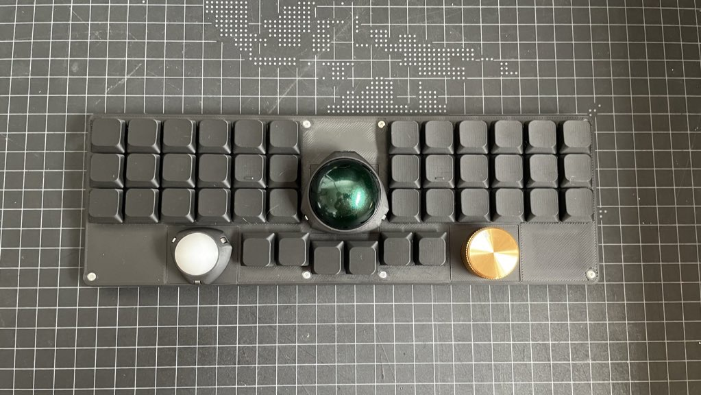
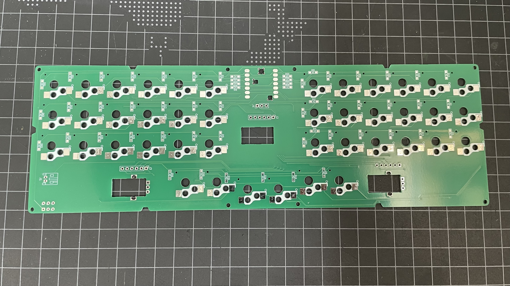
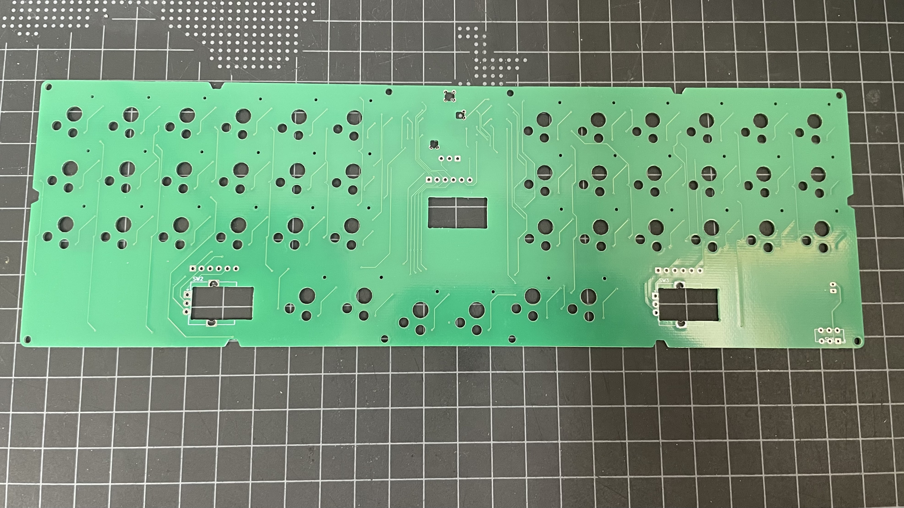
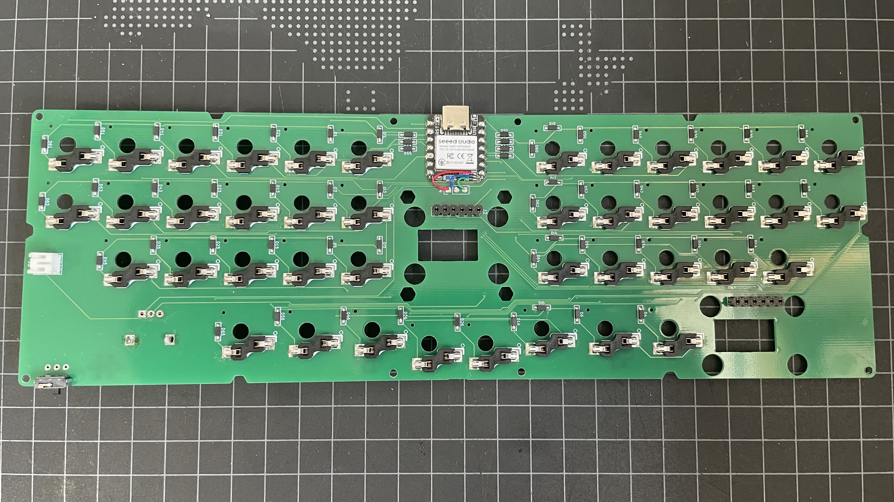
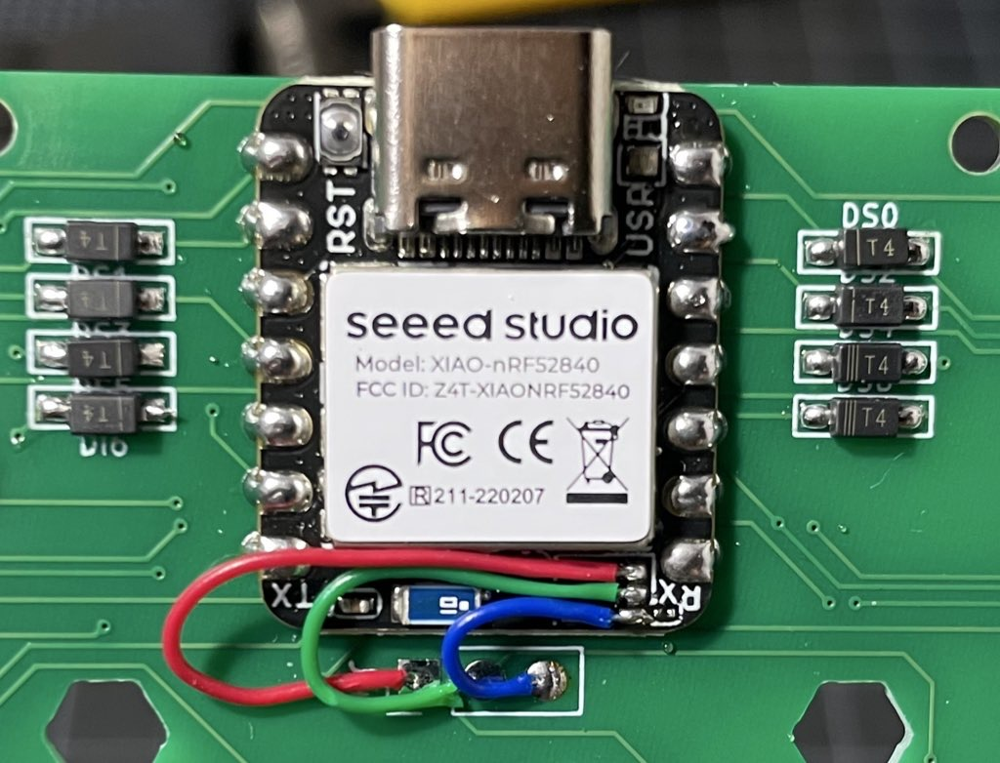
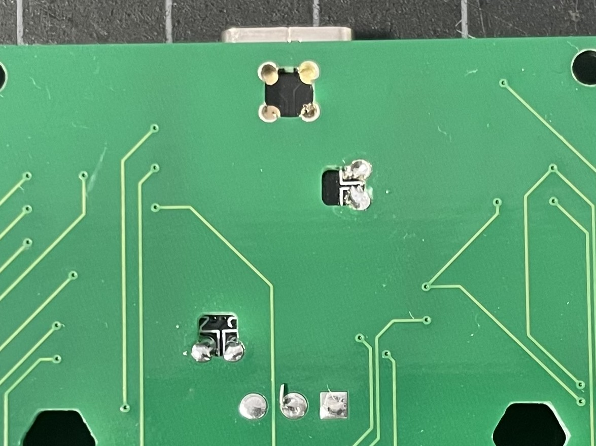

# OnCoroCoroのビルドガイド

## 完成イメージ

## キット内容

|キット番号|キット名|説明|想定対象|
|:-:|:-|-|-|
|1|Base Kit|ベースのキット（メカ部品を同梱）|トラックボールは真ん中だけでいい人向け|
|2|Trackball Kit|デュアルトラックボール体験キット|トラックボールを2個使いたい人向け|
|3|PCB Kit|PCBのみのキット|必要なものは自分でオーダー、3Dプリントする人向け|
|4|Full Kit|（ほぼ）全部品を同梱したキット|届いたらすぐに組み立ててたい人向け|

## 必要なもの

|アイテム|個数|入手先（例）|キット1|キット2|キット3|キット4|
|---|---|---|---|---|---|---|
|PCB|1|本キットに同梱|o|o|o|o|
|XIAO nRF52840|1|[秋月電子](https://akizukidenshi.com/catalog/g/g117341/)|x|x|x|o|
|PMW3610|1-2（必要に応じて）|[Aliexpress](https://ja.aliexpress.com/w/wholesale-PMW3610.html?spm=a2g0o.home.search.0)|1個|2個|x|2個|
|PMW3610ブレークアウト基板|1-2（上記と同じ個数）|[オープンソースのもの](https://github.com/siderakb/pmw3610-pcb)|1個|2個|x|2個|
|低背ピンソケット|1-2（上記と同じ個数）|[秋月電子](https://akizukidenshi.com/catalog/g/g103138/)|1セット|2セット|x|3セット|
|ロータリーエンコーダー（EC11互換）|1-2（必要に応じて）|Amazon など|x|x|x|x|
|エンコーダーノブ|1-2（上記と同じ個数）|Amazon など|x|x|x|x|
|ダイオード（1N4148W）|56|[遊舎工房](https://shop.yushakobo.jp/products/a0800di-02-100?variant=37665574420641)|x|x|x|o|
|スイッチソケット（Kailh Choc ロープロファイル用）|42|[遊社工房](https://shop.yushakobo.jp/products/a01ps?_pos=11&_sid=25497d505&_ss=r&variant=37665172553889)|x|x|x|o|
|キースイッチ（Choc V2系）|42|[遊社工房](https://shop.yushakobo.jp/collections/all-switches/Kailh-Choc-V2%E3%82%B9%E3%82%A4%E3%83%83%E3%83%81)|x|x|x|x|
|スライドスイッチ（C接点 L型）|1|[秋月電子](https://akizukidenshi.com/catalog/g/g115370/)|x|x|x|o|
|バッテリー （PHコネクタ付きのもの推奨）|1|Amazon など|x|x|x|x|
|PHコネクタ（L型） （PHコネクタ付きバッテリーを使用する場合）|1|[秋月電子](https://akizukidenshi.com/catalog/g/g112633/)|x|x|x|o|
|ネジ（M2 5mm）|8|[遊社工房](https://shop.yushakobo.jp/products/a0800s2?variant=37665432535201)|o|o|x|o|
|インサートナット（M2 φ3 3mm）|8|[Amazon](https://www.amazon.co.jp/dp/B07JVNZ2L5?ref_=ppx_hzsearch_conn_dt_b_fed_asin_title_5)|o|o|x|o|
|ベアリング（内径3mm/外形6mm/幅2.5mm）|1-2セット （3個/セット）|[Amazon](https://www.amazon.co.jp/dp/B00MQD1VSY?ref=ppx_yo2ov_dt_b_fed_asin_title)|o|o|x|o|
|キーキャップ（17mmピッチ）|42|データ公開|x|x|x|o|
|キーボードケース（3Dプリント品）|1|データ公開|o|o|x|o|
|滑り止め|好きなだけ|好きなもの|x|x|x|x|

## 手順

### PCBの表裏確認

PCBの裏面から作業します。以下の写真で表面と裏面を把握してください。

PCB**裏面**に表面実装がある（ややこしい）。

表面はスルーホールのみ。

### 電子部品のはんだ付け

#### PCB

基本的に、電子部品は裏面に取り付けます。背が低いものから取り付けると作業しやすいです。また、数が多い（≒単価が低い）ものから取り付けすると、失敗した時のダメージが少ないです。

上記方針に従った手順を載せていますが、その通りでなくても構いません。最終的に下記イメージになるように進めてください。

全てはんだし終わった状態（PCB裏面） ※PCBバージョンの影響でキットのものとキー配置が一部異なります。

1. ダイオードをはんだ付けします。

1. スイッチソケットをはんだ付けします。

1. （注意）スライドスイッチをはんだ付けし、足をニッパーで切断します。

    スライドスイッチは表面にシルクスクリーンがありますが、裏面に取り付けることを想定しています。

    また、6つ足分のスルーホールがありますが、手前3つのみを使用します。

1. 中央の6列の穴に低背ピンソケットをはんだ付けします。
    - Trackball Kit をご購入の方は、**表面からみて**左右お好みの方にも低背ピンソケットをはんだ付けします。
    - Full Kit をご購入の方は、左右両方につけていただいて構いません。

    はんだ付けが終わったソケットの足をニッパーで切断します。

1. PHコネクタをはんだ付けします。

1. （難易度高め）下図のようにマイコン（XIAO nRF52840）をはんだ付けします。

    (注意) マイコンの裏面とPCBの裏面がくっつくようにはんだ付けします。

    マイコン表面＝PCB裏面
    

    マイコン裏面＝PCB表面
    

    1. 裏面のはんだパッドに合うようにマイコンをマスキングテープ等で仮止めします。
    1. まず、左右列の対角上をはんだ付けし、マスキングテープを外して位置ずれがないか確認します。
    1. マイコンの裏側（=PCBの表面）からもはんだを流し込むので、PCB表面からも位置ずれがないか確認します（まだはんだは流し込みません）。
    1. この工程までで位置ずれがあれば、はんだを吸い取って1から再度やり直せます。位置ずれがなければ次の工程に進みます。
    1. PCB裏面から全てのGPIOをはんだ付けします。
    1. PCB表面から、はんだを流し込みます。
    1. PCB裏面から、3本線を写真のように空中配線します。

以上で各キットの共通部分のはんだ付けは終了です。お疲れさまでした。

#### PMW3610ブレークアウト基板

#### ロータリーエンコーダ

### メカ部品の組み立て

## その他
